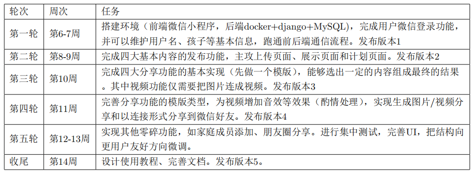
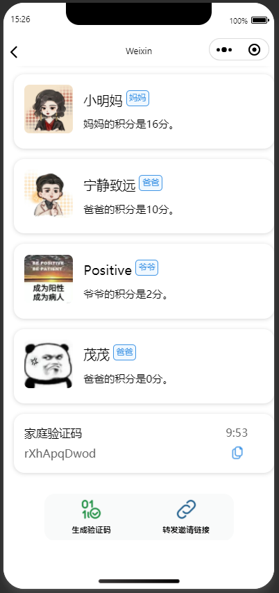
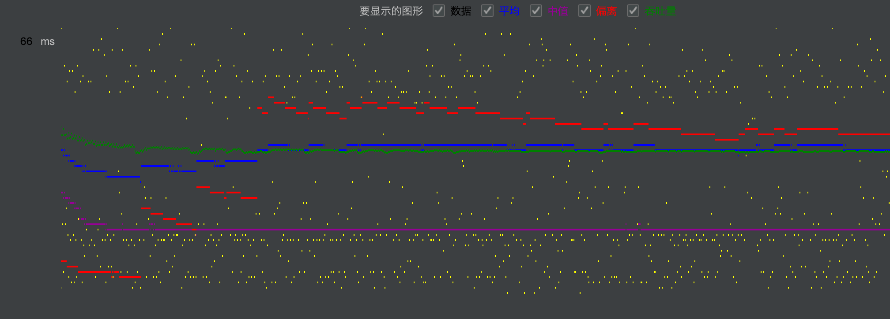
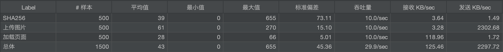
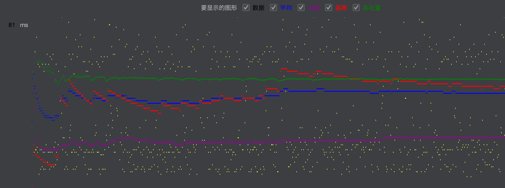
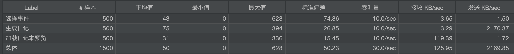
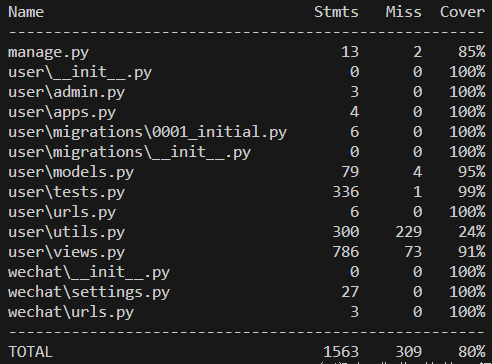
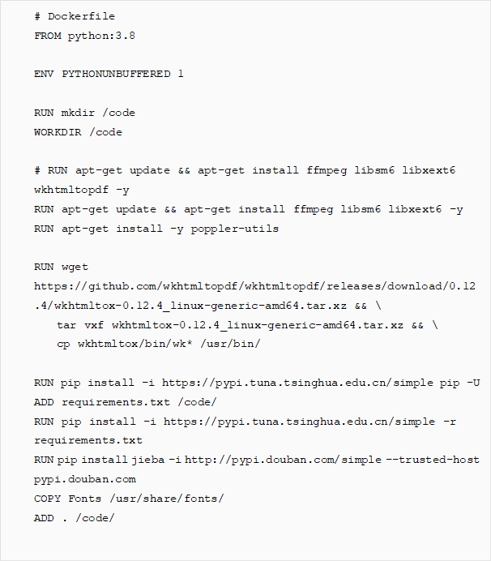
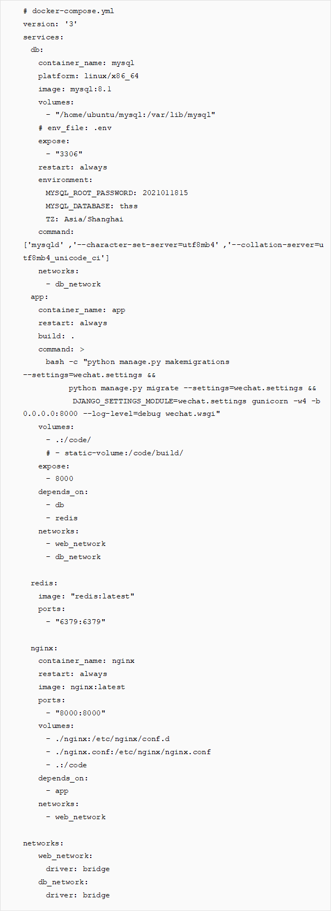

# 乖乖记交付文档

> 白润声 林敏芝 王皓雯 郭嘉伟

<span style="font-size: 24px; font-weight: bold;">目录</span>

[TOC]

---

## 1 产品背景

在孩子的成长过程中，身为父母，或多或少的都会有记录孩子成长的想法。然而，目前比较广泛的记 录方法仍然是手动记录而，而最常用的记录工具也仅仅是简单的相册或者日记本。繁琐、单调的方式不仅 仅使得记录本身变得困难，更是阻碍了许多父母开始记录孩子的生活。 

此外，记录的意义除了在于记录本身，也在于与亲近的人分享记录中的幸福与快乐。对于传统的记录 媒介，形式的整理、分享对象的寻找都需求家长花费不少的精力；而现存的相对新兴的媒介，又存在着针对性差、可记录内容不够广泛、分享方式单调等一系列问题。 

因此，我们察觉到需要一款专门用于记录孩子成长的软件，该软件项目的目标在于：以相对简单的方式，实现记录孩子成长过程中父母最关心的内容，并且提供美观、便捷、多样化的展示和分享形式。


## 2 产品概述

- 产品名称：乖乖记

- 产品简介：一款帮助家长实现简易、多元的孩子成长记录的微信小程序

- 开发人员：C03组 白润声；林敏芝2021011791；王皓雯；郭嘉伟；

- 服务器：IP地址:43.138.42.129:8000；

- 小程序appid

- 初始管理员账号：用户名：ubuntu；密码：8j{wMLlr<rV`7

- 项目二维码：


## 3 产品目标

- **功能目标**

  - **上传**

    需求描述：用户（家长）可以通过点击app主页（即记录展示界面）下方的“+”按钮新增一个纪录， 完成上传事件、上传文字、上传数据这三项功能。另外可以通过计划页面中的功能上传计划和计划内的待办。

  1. 上传事件交互流程：用户点击“上传事件”按钮，即可进入事件的编写页面。用户按照提示填写该事件的标题、正文（对该事件的描述），并通过点击图片栏的相机符号上传手机相册中的图片后，可以选择填写日期和地点，最后点击“发送”按钮，完成事件上传。

  2. 上传文字交互流程：用户点击“上传文字”按钮，即可进入文字的编写页面。上传文字功能主要服务于家长的写感想、写随笔、写心情等具有一定思考性、有一定深度的内容的需求，因此区别于上传事件，此功能没有上传照片的功能。

  3. 上传计划交互流程：：用户点击“计划”页面中“所有计划表”右侧的按钮，进入到可以查看所有已有计划的页面，点击右上角的"+"号，即可进入上传计划页面。按照提示填写该计划的名称，并在下方一次填写这个计划涉及的若干步骤（打卡点）及其时间，之后点击右上角的保存按钮，即可完成新增计划。

  - **内容显示&管理**

    进入程序后，默认的主界面便是展示界面。这个页面展示了之前上传的所有信息，并且提供细致查看与管理的功能。主界面中，会展示事件、文本、数据信息，需求的操作、展示方式如下：

  1. 事件：以标题含文字描述含图片的形式记录；展示页面中，呈现形式为一张大图含标题含缩略描述。可以点击具体事件跳转到详细页面，页面中显示完整的图片含标题含描述。详细页面中，右上角的垃圾桶按钮即删除该记录。

  2. 文字：上传文字记录；展示页面中，呈现形式为文字内容通用标签含缩略文本。可以点击具体记录跳转到详细页面，页面中显示完整的记录。详细页面中，右上角的两按钮和时间页面的功能和操作相同。

  3. 数据：上传数据，选择标签添加具体数据；展示页面中，呈现形式为数据内容通用标签含上传数据。可以 点击具体记录跳转到详细页面，页面中显示本次上传的数据（不涉及过往数据）。详细页面中，右上角的两按钮和时间页面的功能和操作相同。

  - **生成分享**

    需求描述：用户可以通过点击app主页（即记录展示界面）下方的右起第二个按钮来进入分享功能，来完成时间轴分享、日记本分享、合成视频分享、折线图分享的功能。

  1. 日记本分享：交互流程：用户点击该页面的“日记本”选项卡，可以看到若干封面和纸张的模版。选择合适的搭配并自定义日记本名称，点击下方“生成日记本”按钮，即可进入到事件或文字的选择页面。用户可以选择标签来从所有事件中一键导入有该标签的事件，然后在筛选出的标签中选择需要添加的事件（点击该事件标题旁边的checkbox）。选择完成后，进入结果页面。结果页面就展示了按照用户选定的模版和所选的内容自动排版生成的日记本（看起来像一个电子文档）。用户可以选择导出pdf或者长图进行保存和分享，也可以用微信链接分享。

  2. 小视频分享：交互流程：本功能主要针对事件中图片的视频化及分享。用户点击该页面菜单栏的“小视频”选项， 即可选择喜欢的BGM。再进入按照标签筛选相应事件中的图片， 选择完成后点击完成按钮，即可预览结果。结果支持自动配合音乐踩点。如果满意可以导出并保存或用链接形式分享，不满意也可以退回修改。

  - **用户信息管理**

    信息管理页面的主要需求是：展现软件详细信息，管理用户家庭信息和其他功能。家庭信息包括两方面：其一，绑定家庭成员，以方便共享地编辑孩子的成长；其二，管理孩子信息，以方便多孩家庭中的同时上传、生成与记录。

  1. 添加家人：支持链接和二维码的邀请方式，通过时效性和禁止转发保护家庭的安全隐私。家人加入家庭后可以共享所有信息。
  2. 添加孩子：支持添加孩子的头像、姓名和生日。添加后孩子界面支持查看孩子的详细数据和统计数据。

- **性能目标**

  - 并发量支持要求: 要求 500 并发量

  - 响应时间：对用户请求的响应时间在2秒以内。

  - 吞吐量：每秒能够处理至少50次请求


## 4 产品开发组织管理

### 4.1 过程管理

<div align="center">  </div>


### 4.2 人员分工

在开发阶段，我们的任务划分主要依据于功能点进行，每个人参与同时包括前端、后端的全栈开发，具体内容如下：

- 基本框架搭建：林敏芝

- 注册页面：王皓雯

- 主展示页面

  - 主展示页面：郭嘉伟

  - 主展示页面性能优化：郭嘉伟

  - 事件、文本上传与详细页面：郭嘉伟

  - 数据上传与详细页面：白润声

  - 搜索功能：林敏芝

- 计划页面：
  - 主计划页面：白润声
  
  - 全部计划页面：白润声
  
  - 具体计划页面：王皓雯
  - 创建计划页面：王皓雯
  - UI调整：白润声、王皓雯

- 生成页面

  - 时间轴生成：白润声、林敏芝

  - 日记本生成：郭嘉伟

  - 小视频生成：王皓雯

  - 数据图生成：林敏芝

  - 选择事件UI优化：郭嘉伟
  - 时间轴、数据图UI优化：白润声

- 用户页面

  - 家庭成员页面：王皓雯

  - 孩子页面与添加孩子：王皓雯

  - 孩子详细信息页面：林敏芝

  - 家庭页面与加入家庭（验证码、邀请链接）：王皓雯

  - 意见反馈页面：王皓雯
  - 关于我们页面：王皓雯

- 其他

  - 后端部署：王皓雯

  - API文档：林敏芝

  - 仓库管理与分包：白润声

  - 单元测试：白润声

  - 性能测试：郭嘉伟

  - 自动化测试（GitHub Actions）：王皓雯


### 4.3 开发环境

#### 4.3.1 前端

- 操作系统 Ventura 13.3.1, Windows 11

- IDE: 微信开发者工具

- 开发语言：wxml, wxss, js

- 组件：weui, ec-canvas

#### 4.3.2 后端

- 操作系统：Ubuntu 22.04

- IDE: Visua- Studio Code

- 开发语言：Python 3.8

- 组件：Docker 24.0.7,  Django 4.2.5, gunicorn 19.9.0, mysq- 8.1, nginx latest

- 配置后端开发环境方法：

```
cd backend
docker-compose up
```


### 4.4 版本控制

本项目的开发采用git进行版本管理，并利用github进行协同开发，主要的开发规则如下：

#### 4.4.1 分支管理

- 开发主分支为dev，不允许直接更改，只允许通过具体功能分支的合并进行更改；项目主分支为master，不允许直接更改，每次版本更新时会项目创建者从dev合并；

- 开发新的功能模块时，应从dev下创建新的分支。新分支开发结束后，合并至dev分支；

- 合并与推送前，应预先拉取最新的dev分支，解决可能的冲突问题

#### 4.4.2 commit信息

具体格式为: `<type>(<scope>): <subject>`

- type表示提交种类，可以是feat（功能开发）、fix（错误修正）、refactor（代码重构）等；

- scope表示更改范围，可以是front（前端）、back（后端）、other（其他）等；

- subject是对更改内容的具体描述；

- 详细要求可见：<https://github.com/Brs-sss/Growth-Snap/blob/dev/README.md>。


## 5 系统设计

### 5.1 前端交互

本应用前端页面的UI设计追求卓越，各个成员都投入了相当的精力。在设计上，基本上遵循以下原则：

- 直观性： 我们的UI设计易于理解和使用，使用户能够直观地了解界面上的功能和操作方式，减少学习成本。进入应用后用户可以发现菜单分为四个部分，这与许多App相同，用户能迅速明白使用方式。

- 简洁性： 我们的界面避免过度复杂，只包含必要的元素和信息，以确保用户能够迅速理解和操作。例如在用户发表了一定的事件后，主页整体是灰白配色，每个事件一张卡片，标题、简介、首图、时间都一目了然，没有冗余信息。

- 可反馈性： 在用户执行操作后，我们的界面会通过明确的反馈（例如动画、提示信息或状态变化）告知用户操作的结果，增强用户对系统的掌控感。例如视频生成时间较长，我们添加了进度条；例如日记本生成的预览与展示涉及到图片的传输，我们就增加了

- 一致性：我的UI界面配色简单一致，主要采取白、蓝配色，图标、按钮等较为醒目；界面整齐且简洁，便于陌生用户快速熟悉，不会对用户造成困扰。

- 响应性： 我们的界面设计注重不同设备和屏幕尺寸的响应性，确保用户在使用不同型号的手机、平板等设备时都能够获得一致的用户体验。元素的大小和布局会根据屏幕大小进行自适应，不会产生过大的相对形变，以确保内容在各种设备上都能够清晰可见和易于操作。

- 符合法规和标准： 遵守用户隐私、无障碍和其他相关法规和标准。在访问用户相册等私密数据之时，我们会在前端争得用户的权限许可。这不仅有助于维护用户的信任，还可以避免法律问题，并使应用更具可持续性。

在这些原则之外，因为前端涉及到审美问题，不同人可能有不同的理解。为了减少我们开发成员个人的审美偏好的影响，我们积极学习优秀的、久经考验的UI设计风格与样式，并在我们能力范围内合理借鉴。例如，主页展示页面各个事件都组成图片卡的形式排布，看起来清晰、直观、井然有序，这实质上是融合了小红书与微信朋友圈展示页面的结果；计划页面各个子模块（如最近七天计划、所有计划等）均采用了圆角毛玻璃的效果，看起来自然且顺滑，这实际上是我们借鉴了iPhone的精妙的UI圆角设计的结果。


### 5.2 后端模块与接口

在接口设计规则方面，我们遵守如下原则：

- API的单一职责：一个API只负责一个功能，方便后端维护和前端开发。

- API的低耦合性：API之间基本不存在交叉，降低API的依赖程度，提高可维护性。

- API的统一要求：API的调用方法、命名规则等方面进行了统一要求，例如使用大写字母分割单词，并且以load、submit等描述功能。

- API的简单可靠：在实现时，我们尽可能的考虑了API的效率，简化API操作。

 

后端接口服务于整体软件涉及，在架构上可以分解为三个模块，内容如下：

1. 数据模块：包含数据（事件、文本、数据）的上传、删除和加载。其中，加载部分按照主显示页面和各项具体页面的要求，分别实现响应接口。
2. 计划模块：包含计划的创建、删除，todo项的创建、删除更改，以及按照不同页面要求进行数据的加载。
3. 生成模块：包含日记本、小视频的生成接口，以及相关的缩略图等接口。这两项需要生成对应文件，因此文件生成由后端接口负责；包含时间轴、数据图的数据获取接口，这两项需要有相应的图标动态操作，因此在前端利用组件实现，后端负责提供数据。
4. 用户模块：包含用户个人信息的注册和获取，家庭的注册与信息获取，孩子的创建与信息获取。

 

关于API的具体使用方法和内容，详见API文档  todo：连接


### 5.3 数据库

在软件设计中，数据库主要承担三方面责任：1.上传事件、文本、数据内容的储存；2.家庭、用户、孩子信息的储存；3.两方面信息的绑定与关联，以及按需获取特定数据。大致如下：

- 用户类User，以外键形式关联到家庭类Family，Famliy中一对多关联。类中储存对应对象的基本信息，如id、名字等；

- 基类BaseRecord，以外键的形式关联到User，以及一对多关联Child。具体的事件类Event，文本类Text，数据类Data包含一个BaseRecord，实现复用，另包含具体的数据内容。另有Record类服务于数据记录和图标生成；

- 计划类Plan，关联User且一对多关联待办事项类Todo。


### 5.4 安全机制

因为我们的软件设计到家庭和孩子的信息，因此保护用户信息的隐私和安全非常重要。我们的软件在新用户加入家庭功能方面设置了如下的机制：

- 如果新用户在注册的时候是加入到已有的家庭中，则需要填写家庭验证码。家庭验证码可以通过已在家庭中的成员生成，每一次生成的有效期为10分钟。用户填写有效期内的验证码则可以成功加入家庭。否则前端会提示“家庭验证码错误或者过期”。

  <div align="center">  </div> 

- 如果新用户是通过家庭成员发的邀请链接加入家庭的，则注册页面的家庭验证码一栏显示“已填写验证码”，且分享链接禁止二次转发。


### 5.5 性能加速

性能对于我们的微信小程序，性能瓶颈往往出现在如下一些场景：

- 用户第一次进入主页面，需要后段查询数据库找到与该用户关联的所有事件、文字、数据记录，这个过程需要后端繁忙。特别是当这个用户的事件特别多的时候，所有图片、文本内容都要同时传输

- 有新的事件从后端传到前端，涉及到图片的传输，根据网络情况的优劣，可能会出现延时甚至无响应

- 用户在主页面与某个其他页面之间来回快速切换，导致主页面被反复加载

- 用户的同家庭成员对事件进行增删，用户虽然没有任何操作，但也应当随着家庭成员的操作同步更新

以上问题带来的结果是用户在主页面的体验不好，有时会出现进入主页面后一段时间内图片迟迟无法加载出来的情况。对此，我们做出了如下优化：

- 主页面使用懒加载：当用户上传的事件比较多时，一次性从后端发送到前端就会受到网络性能限制以及前端渲染速度的限制。 一次性加载大量事件卡片可能不太理想，因此可以考虑分批加载，我们采用增量5-加载。首次加载时，只请求后端传送的前5个事件卡片，而不是全部。剩余的卡片则在用户滚动页面时逐批加载，请求接下来的5个事件或文字、数据记录。

- 在后端为负责查询、整合事件等数据的接口添加Redis缓存。Redis的主要特点是将数据存储在内存中，这使得它非常适合用作缓存系统。由于内存的读写速度远远快于磁盘，Redis能够提供快速的数据访问。我们为查询到的结果（和这个用户关联的所有事件）设置了60s的缓存，这意味着60s内用户重复请求所有事件（如从其他页面切回主页，或者触发懒加载）不会再重复查询数据库，这大大减轻了大宗数据库查询的频率，既缩短了响应时间，又提高了服务器可承载的并发量。

- 缓存失效问题：由于设置了缓存，当用户或者其家庭成员在缓存有效期间进行了事件、文字、数据的增删，那么可能会带来增删无法及时显示的问题。为此，我们对相应的接口函数进行了修改，使其适应了缓存的存在，在发生改动时主动清除缓存。

以上性能优化进行后，用户体验明显改善。


## 6 重难点问题及解决方法

### 6.1 唯一标识符（id）

乖乖记App是围绕着事件、文字、数据（以下简称事件）为核心的一款记录程序，每个用户都可以上传很多各种各样的事件，所以后端数据库也需要把这些事件存储下来，并和此用户关联起来。事件的内容有很多条目，其中有结构化存储的，如标题、发表时间、正文等，也有非结构化存储的，例如图片。如何管理这海量事件就是一个问题。前端点击一个事件卡片，他对应后端数据库中的哪个事件？一个事件可以“拥有”很多张图片，图片是不易于存储在数据库中的，我们将它存储在服务器的文件系统中，那么如何关联这些事件和它们的图片？

 

我们的解决方案是：为每个事件分配一个唯一的标识符（id）。有了这个id，后端把事件列表发给前端的时候，就可以把每个事件都带上它的id，前端想要进行增删改查时，只需要请求对应的接口函数并把这个id给到后端即可。同时，图片的存储问题也解决了。我们在某个目录下设置一个ImageBase文件夹，其中就是一个个以id命名的文件夹，每个小文件夹内就是这个事件对应的图片。每个图片不管原来命名是什么，在id文件夹下，一律按照用户上传的顺序以0_...  1_...的形式命名，依次类推。这样就可以在ImageBase/[id]/[index]_[name].png（示例）下访问到事件的图片了。

 

接下来的问题就是如何生成此唯一标识符id。我们的生成方法形式化如下。

<div align="center">  </div> 

其中user.openid表示上传该事件的用户的openid，有微信分配，对用户是唯一的且用户间不同的。sysytem.GMTtime表示后端开始处理该事件的格林威治标准时间。因此这两个字符串拼接后的字符串就表示唯一的用户在一个时间点上传的事件，只要一个用户不在同一秒钟内上传两个事件（这是不可能的，因为前端操作需要时间），就不会产生两个完全相同的字符串。为了方便管理，对字符串进行SHA256摘要函数处理，利用密码哈希函数的抗碰撞性质就可以得到一个唯一的32Bytes的id，并用十六进制转化成的ascii码表达，例如一个可能的事件id就是2edc9ad665a8041dada21343e40291538393bb0d61eb853720139b0dc844d848。


### 6.2 图片上传失败的处理

网络条件不好时，会出现图片上传不及时、甚至上传失败的情况。对此我们设计了一套逻辑，使得在后端还没有用户上传的图片的时候，前端可以显示一个“图片不见了”的提示。这也适用到时间轴、日记本、小视频。

<div align="center">  </div> 


### 6.3 日记本

日记本生成是乖乖记App重点推出的功能。我们的任务是将用户选定的若干事件（每个事件包含若干条文本和若干张图片）排版成像日记一样的、一篇一篇的、图文并茂的一个PDF格式的文件。为了实现这个功能，我们尝试了很多技术路线，比如python的reportlab库、FPDF库等，它们可以直接把文字和图片（在指定坐标后）排版成pdf文件。经过若干尝试，这一路线被抛弃了，这是因为它的可拓展性不强，需要手动指定文字和图片的位置，更致命的是它们无法插入一个可以覆盖整个pdf页面的背景图片。而我们的日记本是有封面和纸张图片的，如果背景图片不能完全覆盖，那必然十分丑陋。

 

经过一系列试错，另一条技术路线进入视野：首先用html排版这些图片和文字，利用html和css强大的排版能力，几乎可以实现我们所有想要的排版形式，然后将html转换成pdf。接下来的难点就在于如何根据输入的文字和图片输出我们想要形式的的html，以及如何把html“保真的”转换到pdf。先说html到pdf的转换，这里也进行了大量的试错，几乎试遍了所有可能的库，如weasyprint等，结果效果都不好。最后我们选择用PyPDF库，它是对软件wkhtmltopdf的Python的封装，但它的问题在于难以操控，没有成熟的文档和教程，使用过程中经常遇到无法解释的问题。再经过一系列的试错后，我们终于实现了将单页的pdf转换成单页pdf的函数。

 

之所以说是单页，是因为此时如果一个事件的文字较长、图片较多，排版需要两页甚至更多页时，就会出现问题：第一页底部不会留白，而是文字直接像正常排版一样占满；第二页顶部也不会留白，而且第二页也没有背景图片。就好像是html是顺着排版的、没有间隙的，而转换成pdf后并没有自动分页，只是将多出的部分强行割开成为第二页、第三页等。这是因为目前我们把图片和文字排版成html的时候就是这样的：利用jinja的模版语法将相应的空位（如标题、正文、图片等）填充成实际的内容。这样如果一个事件很长，那么html仍然看起来时一页，但是转换成pdf就出现了分割问题。

 

我们要为这种单个事件的排版注入智能：希望图片文字转换成html时可以根据文字、图片的量智能地将它们合理排版成多个html，并且每个html排版后都不能超过一页，这样转换到pdf时就不会出现问题。这个问题也是non trivial的，因为据调研并没有一个Python智能排版工具。最终，解决方案如下：利用reportlab库测算在当前分辨率下每个字符、单词在A4纸上占据的实际宽度，然后顺次排版直至可能大于行宽度就生成一行，以此类推，把文本分成了若干行。然后需要把这若干行与图片有机穿插，形成若干页。仍然利用实际长度测算技术，根据行高和图片高度、页面高度进行排版。之后把每一页的内容分别给到html模版去渲染。初步成功。

 

此外，我们还考虑到了中英不同的差异：中文任意两个相邻汉字之间都可以断开换行，不影响阅读，但英文必须以单词为单位进行划分，如果只看字母的宽度，就会有大量半截的英文单词，必然影响阅读体验。因此对于英文文本，我们必须输入单词列表而不是字符列表，每次测算宽度必须是一个单词的宽度。为此，我们使用了langdetect库，识别文本的语言，分为两类：可以按字符划分如汉语、日语、韩语，必须按照单词为单位划分的如英语、西班牙语等。按照两类分别分词排版。

 

这样，一个实现把任意量的文字和图片排版成精美的PDF的功能就初步实现了。


### 6.4 小视频

- 小视频制作过程中遇到了事件的照片尺寸不一的问题，对此解决的办法是尽可能的从照片中心取16：9的部分。

- 为了让不同配乐的小视频播放事件照片的时候都能达到“踩点”的效果，我们利用了一些音乐网站获取了每一个配乐的BPM，即每分钟的拍子数。之后换算成照片播放时的帧率。这样当用户选择不同的配乐的时候，后端按照不同的频率来生成“踩点”视频。


### 6.5 时间轴

- 使用了echart图表库，但其排版和图片文字的处理都需要手写。在仔细调整后，支持合理数量的图片显示。最困难的问题是生成后即时调整模板和主题色并及时显示的问题，通过修改echart支持的图表数据定义，将调整模板的按钮与删除旧图、显示新图的函数关联实现。

- 考虑切换事件的性能，在添加事件后会预加载所有模板的所有数据结构，切换时直接将数据组加载到initchart中即可。

- echart全屏图象显示时不可滑动，通过在页面两侧添加侧栏允许滑动。


### 6.6 折线图

- 当用户添加数据时，可能希望按照时间等比排列折线图查看，也可能希望按照上传次数等间隔查看。考虑用户需求后，添加了"按时间均匀排列"的按钮，点击可以切换两种显示方式。实现方式主要是调整图表横轴时间数据的计算和排列方式。

- 图表界面的所有切换都是实时显示的，给用户更好的生成体验。通过将所有按钮与删除旧图、显示新图的函数关联实现。且需要注意切换不同数据组、模板时，需要禁用和启用数据组或模板特色功能（如身高、体重登身体数据在科学模板下可以显示标准数据）。

 

## 7 测试总结

### 7.1 功能测试


### 7.2 性能测试

- **测试场景与参数设置**
  - 场景一：用户上传事件（包含两张图片，均为200kB以上）——用户查看主页，事件线程数 500，ramp-up 设置为 50
  - 场景二：用户在生成日记本页面选择事件（2个）——用户提交事件——用户预览生成的日记本，线程数 500，ramp-up 设置为 50

- **测试结果**

  - 场景一

    <div align="center">  </div>

    <div align="center">  </div>

    分析场景一性能可知：

  ​	1. 响应时间：由图 ...中可以看出，三个请求的平均响应时间分别为 39ms，61ms，28ms，能保持较好性能。

  ​	2. 业务成功率：在测试中，所有的测试均成功，返回内容无差错，说明本场景测试全部通过，业务成功率为 100%。

  ​	3. 并发数：线程组设置为 500 个线程，运行过程未发现任何异常，满足 500 个线程并发操作要求。

  ​	4. 吞吐量：每个子任务吞吐量均在 29.9/sec 左右，能满足本场景下请求处理需求。

  - 场景二

    <div align="center">  </div>

    <div align="center">  </div>

    分析场景二性能可知：

  ​	1. 响应时间：由图 ...中可以看出，三个请求的平均响应时间分别为 43ms，75ms，21ms，能保持较好性能。

  ​	2. 业务成功率：在测试中，所有的测试均成功，返回内容无差错，说明本场景测试全部通过，业务成功率为 100%。

  ​	3. 并发数：线程组设置为 500 个线程，运行过程未发现任何异常，满足 500 个线程并发操作要求。

  ​	4. 吞吐量：每个子任务吞吐量均在 30.0/sec 左右，能满足本场景下请求处理需求。

 

### 7.3 单元测试与集成测试

单元测试的目的是对后端API接口检测单一功能中的潜在错误，而集成测试则是对各个API之间的协作关系进行检测。在本项目中，API与功能需求绑定的较为紧密，而用户在使用某项功能时存在着多种多样的程序上下文。这就会导致不同的程序上下文引起API表现的不同，成为了系统缺陷的主要来源。而每个API本身的功能完善性虽然也与系统正确性相关，但API协作错误与之相较更加难以发现和改正，例如：上传事件的多少会影响展示页面的加载、生成信息的选择、用户信息的获取等多个看似无关的功能组的表现。因此，在本项目的测试中，我们选取了单元测试为辅（主要针对工具性函数），集成测试为主（对整体API）的测试策略，有利于构造更丰富的程序上下文。具体的用例中，我们将有关的API分成组，以组合的方式进行测试，内容如下：

1. 注册功能组API测试，包含：注册、登陆、家庭等API基本调用，以及未注册直接登陆、重复注册、注册空家庭等边缘案例。
2. 上传、加载功能组API测试，包含：上传/删除事件（含照片）、文本、数据，对应的具体页面加载，以及用户信息更新、多次上传等边缘案例。同时也包含搜索等相关功能的测试。
3. 计划功能组API测试，包含：计划的创建、删除，待办项的创建、产出及更改信息，以及删除非空计划、创建重名计划等边缘案例。
4. 用户、家庭、孩子功能组API测试，包含：创建家庭、孩子，上传对应孩子信息与三者各类信息的获取，以及空信息获取等边缘案例。
5. 生成功能组API测试，包含：加载时间轴、数据图相关信息，以及不同程序上下文下的信息获取等边缘案例；注：由于django单元测试会构建一个本地服务器，造成生成日记本、小视频引发环境配置问题，因此省略了对于相关API的测试。
6. 其他工具测试，包含：获取微信活动id、获取SHA256哈希值等工具类API。

 

具体的测试结果如下：由于生成API组提及的环境问题，我们省略了生成日记本、小视频的单元测试，最终整体上views文件的覆盖率为84%，基本覆盖率相关代码。排除掉被省略的部分API后，覆盖率打到91%，说明已测试API不同上下文的覆盖情况较高。utils文件中，主要包括用于实现生成日记本、小视频生成的功能函数，因此不在主要测试目标中。排除省略后的coverage report如下：

<div align="center">  </div>


### 7.4 自动化测试

我们使用了GitHub Actions服务，实现在GitHub仓库中自动化执行测试的功能。

- 触发工作流程的特定事件是[push, pull_request]

- 阶段运行的镜像是: ubuntu-latest

- 作业的步骤包括：

  -  进入代码根目录

  - 设置Python环境，缓存pip依赖

  - 安装项目依赖

  - 运行单元测试

GitHub Actions 自动执行各种任务，如构建、测试、部署等，通过减少了手动工作，提高了我们的开发效率。


## 8 系统部署

### 8.1 前端部署

1. 注册微信小程序账号
2. 在根目录下的app.js文件中设置了后端的url

<div align="center">  </div>

3. 在微信开发者工具中填写了小程序的appid
4. 开发完成并进行分包后，在微信开发者工具中上传了代码，获得体验版小程序

 

### 8.2 后端部署

1. 服务器为Ubuntu 22.04
2. 在服务器上安装Docker，参考链接https://yeasy.gitbook.io/docker_practice/install
3. 在服务器上通过```git clone```获得项目代码
4. 修改后端```Growth-Snap/backend/wechat/settings.py```中的APP_ID, APP_SECRET, DATABASES, ALLOW_HOSTS等值。DATABASES使用的是```django.db.backends.mysql```，ALLOW_HOSTS为本地的ip、服务器的ip与app容器。
5. 编写```Dockerfile```和```docker-compose.yml```两个文件。两个文件的内容分别如下：
   - **Dockerfile**

<div align="center">  </div>

- **Docker-compose.yml**

<div align="center">  </div>

我们的项目由四部分组成，分别是：

- Django应用

- MySQL数据库

- Nginx作为Web服务器

- redis作为缓存服务器


5.在```Growth-Snap/backend```下运行```sudo docker-compose up```则可以一键启动Django应用了。